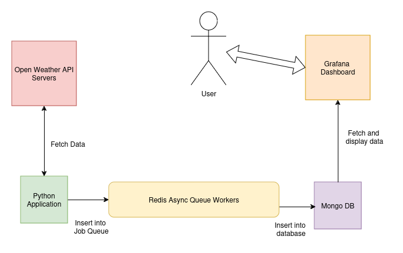

# Real Time Weather Monitor Pipeline
- A real time weather monitoring pipeline that fetches data from Open Weather API (every k mintues) and adds to database as a cron asynchronously using redis worker.
- Data visualization is done using Grafana and MongoDB

---

## Architecture 


---

## Setup

1. Clone the repository

2. Create a virtual environment for the python server by running\
  ```virtualenv venv && source venv/bin/activate```

3. Install all the necessary packages by running\
   ```pip install -r requirements.txt```

4. Start the docker containers by running
    ```docker compose up -d``` 

5. Enter the required environemntal variables present in a .env file

6. Start the worker by running
    ```python worker.py```

7. Run the application by using the command
   ```python3 script.py```
   
